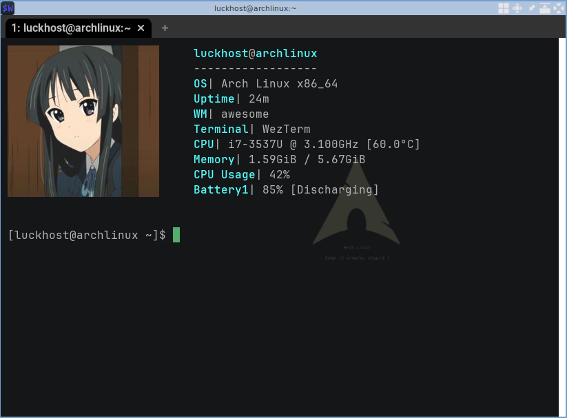

# Конфигурации Awesome wm
---
В этом репозитории находятся конфиг-файлы, которые кастомизируют тайлинговый оконный менеджер "Awesome"

### 1 - Mio theme
Довольно простая конфигурация.
Для меня довольно важным критерием было сохранение заряда батареи ноутбука, именно поэтому здесь всего один виджет. Он показыает количество заряда.

Взят он был с открытого репозитория:
<https://github.com/streetturtle/awesome-wm-widgets>

**Рабочий стол**:

В качестве терминала я выбрал **WezTerm**, так как он имеет хороший вид и имеет функцию вывода картинок в консоль. 
Вот так он выглядит:

